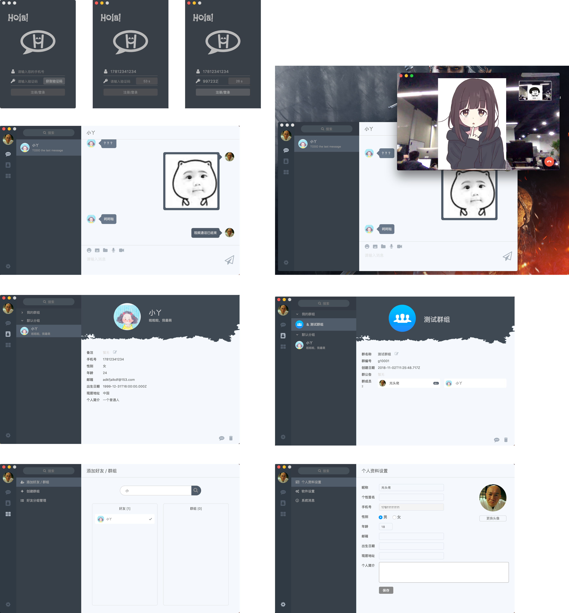

# Hola

## 前言

本项目旨在**从零到壹**，制作一款界面精美的聊天软件。

> **因为已工作，所以可能没有多少时间来继续跟进这个项目了，项目可优化的点已在下文列出，欢迎大家 Fork。**
> 
> ps: 征 logo 一枚。因为本人是开发，设计功底欠缺，所以软件 logo 设计的有点丑，如果有大神有更好的 logo，欢迎 email。

## 技术栈

* **开发环境**
	* 操作系统：macOS High Sierra v10.13.1
	* 编辑器：Visual Studio Code v1.19.1
	* npm：v5.3.0
	* Node：v8.4.0

* **客户端**
	* UI设计：Sketch
	* 软件框架：Electron
	* 界面实现：Vue.js + Vuex + Vue-Router + Webpack
	* 通信模块：[socket.io-client](https://github.com/socketio/socket.io-client)
	* 视频聊天：[原生 WebRTC](https://www.html5rocks.com/en/tutorials/webrtc/basics/)

* **服务端**
	* 服务器：Node.js
	* 后端框架：Koa2
	* 通信模块：[socket.io](https://github.com/socketio/socket.io) 
	* 数据库：Redis 和 MongoDB

## 软件效果图



## 实现功能

- [x] 登录注册模块（<手机号+验证码>形式的登录注册）
- [x] 聊天区模块
	- [x] 最近联系人列表
	- [x] 历史消息（暂未做上拉加载）
	- [x] 私聊
		- [x] 文本消息
		- [x] 图片消息
		- [x] 视频聊天
	- [x] 群聊
		- [x] 文本消息
		- [x] 图片消息
- [x] 联系人模块
	- [x] 联系人列表
	- [x] 好友资料展示
	- [x] 群组资料展示
	- [x] 删好友，退出或解散群组
- [x] 功能区模块
	- [x] 添加好友/群组
	- [x] 创建群组
- [x] 设置区模块
	- [x] 个人资料设置
	- [x] 软件设置
		- [x] 国际化
			- [x] 中文
			- [x] 英文

## 项目目录

```bash
.
├── LICENSE         
├── README.md
├── client          # 客户端代码
├── docs            # 各种文档（需求文档、UI文档、流程图、数据库设计等）
├── preview.png     # 软件预览图
└── server          # 服务端代码
```

## 反思 & 展望

该项目为我大学毕业设计的项目，因时间紧迫，只实现了基本的聊天、加删好友等功能，很多功能还未实现，所以软件还是有很多的瑕疵。为此，我特意思考了很长时间，将待改进的细节或新的功能总结如下：

- [ ] 历史消息做成上拉瀑布流加载的效果
- [ ] 为消息注明消息时间、发送状态、已读未读等状态
- [ ] 为最近联系人列表添加最后一条消息的展示
- [ ] 为最近联系人添加未读消息个数的统计
- [ ] 添加好友或加入群组时要进行确认
- [ ] 为软件的新消息使用系统原生通知窗口通知
- [ ] 为软件增加原生菜单
- [ ] 升级输入框，从而可以向输入框直接插入剪切板中的图片
- [ ] 自己搭建文件服务器，图片服务器（或者使用第三方比如七牛云、阿里云的相关服务）
- [ ] 为 WebRTC 实现后备方案，搭建 Relay Server，以增强视频聊天的稳定性
- [ ] 增加网络断开处理的相关逻辑
- [ ] 了解数据加密相关知识，为消息作加密处理
- [ ] 为软件做跨平台处理，兼容性方面有待加强
- [ ] 实现软件自动更新
- [ ] 接入智能机器人聊天
- [ ] 实现本地存储历史消息（[nedb](https://github.com/louischatriot/nedb)）
- [ ] 为软件加入聊天情况分析（比如每天发了多少条消息，与谁聊天最频繁等）

## 扩展阅读

* [初探 Electron - 理论篇](http://jartto.wang/2018/01/03/first-exploration-electron/)
* [初探 Electron - 升华篇](http://jartto.wang/2018/01/04/first-exploration-electron-2/)
* [XCel 项目总结 - Electron 与 Vue 的性能优化](https://segmentfault.com/a/1190000007665162)
* [【译】Electron 自动更新的完整教程（Windows 和 OSX）](https://segmentfault.com/a/1190000007616641)
* [Getting Started with WebRTC](https://www.html5rocks.com/en/tutorials/webrtc/basics/)
* [通俗易懂：一篇掌握即时通讯的消息传输安全原理](http://www.52im.net/thread-970-1-1.html)
* [即时通讯安全篇（三）：常用加解密算法与通讯安全讲解](http://www.52im.net/thread-219-1-1.html)
* [socket.io断线后重连和消息离线存储如何实现](https://cnodejs.org/topic/57f0fe5ace6d47326a822dc0)
* [Socket.IO stream](https://www.npmjs.com/package/socket.io-stream)
* [运用google-protobuf的IM消息应用开发（前端篇）](http://www.cnblogs.com/1wen/p/6509253.html)
* [Can one hack “paste image” support into a textarea in Firefox?](https://stackoverflow.com/questions/14151018/can-one-hack-paste-image-support-into-a-textarea-in-firefox)
* [在线和离线事件](https://developer.mozilla.org/zh-CN/docs/Web/API/NavigatorOnLine/Online_and_offline_events)
* [im不丢“离线消息”设计](https://blog.csdn.net/wufaliang003/article/details/78638478)